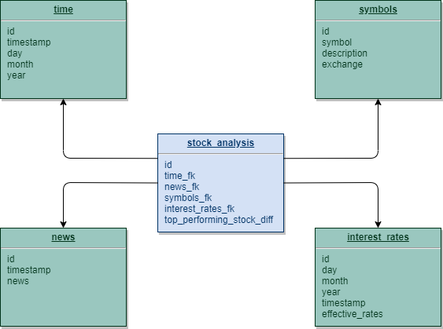

# Udacity Capstone DAG
Airflow DAG and custom operators for the Udacity Capstone project. This DAG loads data from S3 and writes it to Redshift using a star schema, creating a data mart.

This project is partially based on the Udacity Data Engineering pipelines lesson template.

### Description
The project represents an Airflow DAG, which uses custom operators to copy data from S3 and load it into Redshift, in a star schema. The DAG also contains a custom operator which performs data quality checks after the data has been loaded.

### Data dictionary
* interest_rates table:
    * effective_rates: represents the effective Federal Interest Rate
* stock_analysis table:
    * top_performing_stock_diff: this is the difference between the opening price of a stock, and its adjusted closing price, for the company with the best performance on a trading day
* symbols table:
    * symbol: the symbol of the traded company, as displayed on the exchange
    * exchange_name: name of the exchange where the stock was traded (e.g. NYSE, NASDAQ,...)

### Architecture
The tables form a star schema, with the fact table containing the stock difference of the top performer for each day.
The dimension tables are:
* symbols, containing company symbols, description and the exchange where it is traded
* time
* news, containing world news
* interest_rates, containing effective Federal interest rates

The following image represents a diagram of the architecture:
